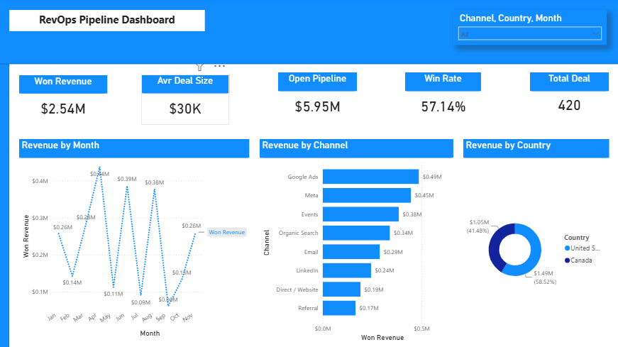
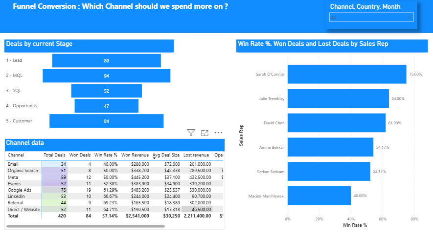
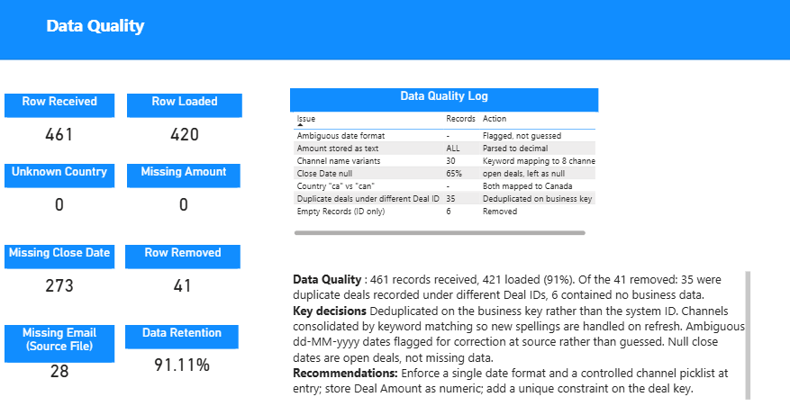

# RevOps Pipeline Dashboard

A Power BI report built from a deliberately messy CRM export: a repeatable cleaning pipeline in Power Query, a star schema with a date dimension, DAX measures, and three report pages covering revenue, funnel conversion, and data quality.

The interesting part is not the dashboard. It is that the headline metric everyone reports — win rate — turned out to be misleading for two of the eight acquisition channels, and the report is designed to show you why.



---

## The brief

Take a raw CRM export, make it trustworthy, and answer one commercial question: **which channel should we spend more on?**

The honest answer turned out to be "not the one the obvious metric points at," and part of the answer is "this data cannot tell you." Both of those are in the report.

---

## The data

461 records from a CRM export, covering eight acquisition channels, six pipeline stages, six sales reps, and two countries over eleven months. The file is synthetic — generated as practice data — but it was built to fail the way real exports fail.

**What was wrong with it:**

| Issue | Records | How it was handled |
|---|---|---|
| Duplicate deals under different Deal IDs | 35 | Deduplicated on the business key, not the system ID |
| Empty records (Deal ID only, no other data) | 7 | Removed |
| Channel name variants (~30 spellings of 8 channels) | ~30 | Consolidated by keyword matching |
| Sales rep name variants (9 spellings of 6 people) | 3 pairs | Consolidated by surname keyword |
| Deal Amount stored as text (`$8,200`, `8 200 $`, `N/A`, `-`) | All rows | Parsed to decimal |
| Created Date in four different formats | All rows | Three parse reliably; the ambiguous ones flagged, not guessed |
| Country coded as both `can` and `ca` | — | Both mapped to Canada |
| Missing email addresses | 28 | Reported as a quality metric; records retained |
| Close Date null | 273 (65%) | Not a defect — these are open deals |

**461 received, 420 loaded, 41 removed, 91.11% retention.** Every removed record is accounted for.

---

## Cleaning decisions worth explaining

**Dedup on the business key, not the ID.** The 35 duplicates each carried a distinct Deal ID, so an ID-based dedup would have caught none of them. The duplication was in the business record, not the system record.

**Map categories by keyword, not variant by variant.** Channel names were consolidated with rules like *contains "google" → Google Ads*, rather than one replacement per spelling. New spellings are handled automatically on the next refresh instead of requiring a new rule each time. The same approach fixed the sales rep column, matching on surname so "David Chen", "D. Chen" and "d.chen" collapse under one rule.

**Country needed an exact-match rule, not just `contains`.** The data held both `can` and `ca`. Since "ca" does not contain "can", a naive contains-match would have silently misclassified those rows.

**Flag ambiguity rather than resolve it.** Created Date arrived in four formats. Three parse reliably. The `dd-MM-yyyy` rows are genuinely ambiguous — `03/04` could be March 4th or April 3rd — so they are flagged for correction at source. Guessing would have produced clean-looking wrong data, which is worse than visible uncertainty.

**Missing text becomes "Unknown"; missing numbers and dates stay null.** Nothing gets forced into a real category to make a chart look tidy.

**Only delete records that contain no information at all.** More on this below, because I got it wrong first.

---

## The model

A star schema with a dedicated date dimension:

```
Date Table = ADDCOLUMNS(
    CALENDAR(DATE(2025,1,1), DATE(2025,12,31)),
    "Year", YEAR([Date]),
    "MonthNo", MONTH([Date]),
    "Month", FORMAT([Date],"MMM"),
    "Quarter", "Q" & QUARTER([Date])
)
```

Marked as a date table, Month sorted by MonthNo, joined one-to-many single-direction to the CRM table. One calendar filters the entire report and time intelligence works.

A second query, `CRM_Raw`, loads the original file untouched and is left **disconnected** from the model. It exists only to count what arrived, so the data quality figures are computed rather than typed. Because it has no relationship, it is only ever used inside `COUNTROWS()` — filtering across a disconnected table returns silently wrong numbers instead of an error.

---

## The measures

```dax
Total Deals    = COUNTROWS(CRM)
Won Deals      = CALCULATE(COUNTROWS(CRM), CRM[Stage] = "5 - Customer")
Lost Deals     = CALCULATE(COUNTROWS(CRM), CRM[Stage] = "6 - Closed Lost")
Won Revenue    = CALCULATE(SUM(CRM[Amount]), CRM[Stage] = "5 - Customer")
Lost Revenue   = CALCULATE(SUM(CRM[Amount]), CRM[Stage] = "6 - Closed Lost")
Open Pipeline  = CALCULATE(SUM(CRM[Amount]),
                     CRM[Stage] IN {"1 - Lead","2 - MQL","3 - SQL","4 - Opportunity"})
Avg Deal Size  = DIVIDE([Won Revenue], [Won Deals])
Win Rate %     = DIVIDE([Won Deals], [Won Deals] + [Lost Deals])
Revenue Win Rate % = DIVIDE([Won Revenue], [Won Revenue] + [Lost Revenue])
Revenue LM     = CALCULATE([Won Revenue], DATEADD('Date Table'[Date], -1, MONTH))
Revenue MoM %  = DIVIDE([Won Revenue] - [Revenue LM], [Revenue LM])
```

Win rate is `Won / (Won + Lost)`, never `Won / Total` — open deals are not losses. Formatting is set at the measure level so every visual inherits it.

---

## The report

### Page 1 — Executive Summary

Won revenue, open pipeline, win rate, average deal size and deal count, with revenue by month, by channel, and by country. Channel and country slicers make it self-serve rather than a static picture.

### Page 2 — Funnel and Conversion



Deals by current stage, win rate by sales rep, and the channel matrix that carries the analysis.

The stage visual is labelled **"Deals by current Stage"** rather than "Funnel" on purpose. Each deal sits in exactly one stage right now, so this is a distribution, not a cumulative conversion funnel. A true funnel needs stage-transition history, which this export does not carry — it would have to come from the CRM's stage change log or a snapshot table. The conversion-rate labels are switched off for the same reason.

Win rate by rep shows won and lost counts on hover, so a rep with three closed deals cannot appear to outperform one with forty.

### Page 3 — Data Quality



Records received against records loaded, retention rate, and counts for every category of defect — computed from the raw file, not typed in. Alongside them, the cleaning decisions and what I would change at source.

Most dashboards ask you to trust the numbers. This page shows you what they are made of.

---

## Findings

### Win rate by deal count and win rate by revenue disagree

Ranking channels by win rate gives one answer. Weighting the same outcomes by dollar value gives a different one.

| Channel | Deals | Win Rate (count) | Win Rate (revenue) | Gap |
|---|---:|---:|---:|---:|
| Referral | 44 | 69.2% | **35.4%** | **−33.8** |
| Google Ads | 75 | 61.3% | **47.8%** | **−13.5** |
| Meta | 59 | 50.0% | 50.7% | +0.7 |
| Events | 52 | 52.4% | 54.6% | +2.2 |
| Organic Search | 51 | 50.0% | 53.9% | +3.9 |
| LinkedIn | 53 | 66.7% | 72.9% | +6.2 |
| Direct / Website | 52 | 64.7% | 80.4% | +15.7 |
| Email | 34 | 40.0% | 58.9% | +18.9 |

Two channels lose more revenue than they win despite strong win rates.

**Referral** has the best win rate in the business at 69.2% of deals, and the worst revenue win rate at 35.4%. Its won deals average $18,389; its lost deals average $75,500. It loses deals four times larger than the ones it wins.

**Google Ads** shows the same pattern more mildly. It won 19 of 31 closed deals but only 47.8% of the closed revenue — $485,200 won against $530,000 lost.

**Email** is the mirror image. The weakest win rate at 40%, but the highest average won deal in the business at $72,000, and it loses small — $33,500 per lost deal. Judged on revenue it outperforms Google Ads.

### Deal size is the hidden variable

Revenue is volume × win rate × deal size, and each channel is strong on a different one.

Meta and Google Ads produce almost the same revenue, but Meta does it with 16 fewer deals and a worse win rate, because its average deal is 47% larger ($37,100 against $25,537). Referral converts beautifully on small tickets. Email converts poorly on large ones.

Reporting win rate alone hides all of this.

### What this data cannot answer

The brief was "which channel should we spend more on." That question cannot be answered from this export, and saying so is part of the deliverable.

There is no cost column. Google Ads, Meta and Events are paid; Organic Search, Referral, Direct and Email are owned. Ranking them together on gross revenue compares bought revenue against free revenue.

To answer the spend question properly I would need media spend by channel, joined from the ad platforms, and would compare CAC and ROAS rather than gross revenue.

### What I would recommend instead

Not a budget reallocation — a diagnosis.

**Referral and Google Ads both win small deals and lose large ones.** That pattern usually means large inbound leads are being routed and qualified the same way as small ones. It is a sales process question, not a media question, and it is worth more than additional spend: there is $5.95M of open pipeline in this dataset, converting at roughly half by dollar value.

**Direct/Website, LinkedIn and Email convert well on revenue at near-zero acquisition cost.** These are margin rather than volume, and they are the cheapest revenue on the board.

---

## A mistake I caught

An early version of the cleaning pipeline filtered out any record with a blank email or company name.

That step deleted 22 real deals and roughly **$89,500 of closed revenue**. They were not empty records — they had a stage, an amount, a channel and a date. They were missing a contact field.

I found it by clicking through the Applied Steps in Power Query and watching the row counter drop from 421 to 399, then reading the filter condition.

It also contradicted the rule written on the data quality page: *only delete records that contain no information at all*. A deal missing an email address contains a great deal of information.

The step was removed. Missing emails are now reported as a metric — 28 in the source file — and the records stay in the dataset. Cleaning data and losing data are different things, and the difference is worth about $90,000 here.

---

## What I would do next

- Join channel spend to compare CAC and ROAS instead of gross revenue
- Source stage-transition history to build a true conversion funnel rather than a stage distribution
- Add cohort analysis on deal creation month to separate seasonality from trend
- Enforce at source: a single date format, a controlled channel picklist, Deal Amount as a numeric field, and a unique constraint on the deal business key

---

## Tools

Power BI Desktop · Power Query (M) · DAX · star schema modelling

## Repository

```
screenshots/                    the three report pages
revops-practice-messy-crm.csv   the raw input file
```

## A note on the data

The dataset is synthetic, generated as practice data and deliberately seeded with the defects listed above. The monthly revenue pattern is random rather than seasonal, so no conclusions should be drawn from the shape of the trend line. The analysis, the cleaning decisions and the findings are real work on that data.
